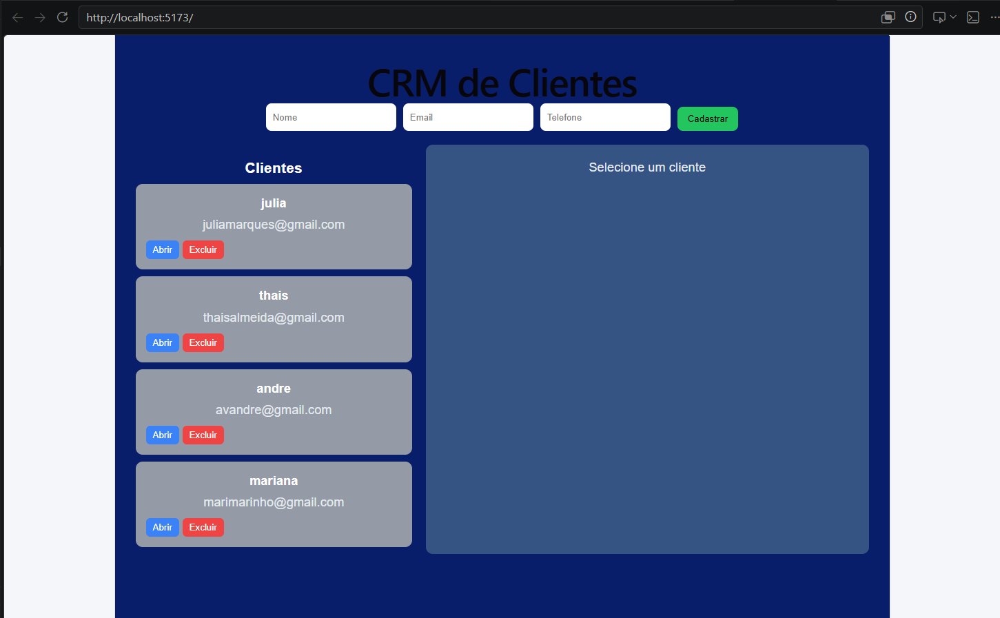
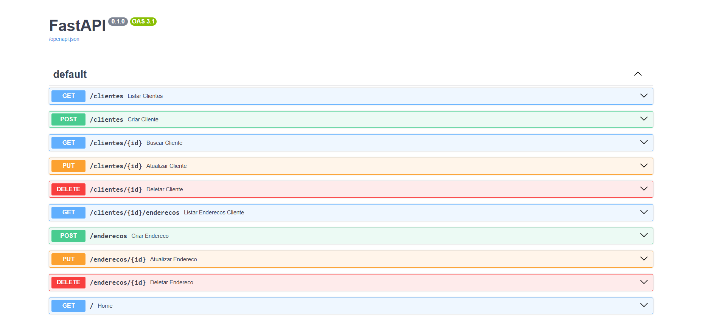

Projeto Full Stack com CRUD de clientes e endereços
# CRM de Clientes

Sistema Full Stack para gerenciamento de clientes e endereços desenvolvido com React, FastAPI e MySQL.

## Sobre o Projeto

Este projeto foi desenvolvido com o objetivo de praticar desenvolvimento Full Stack, incluindo criação de APIs REST, integração entre frontend e backend e persistência de dados em banco de dados relacional.

A aplicação permite o cadastro e gerenciamento de clientes e seus respectivos endereços.

## Funcionalidades

* Cadastro de clientes
* Cadastro de endereços
* Listagem de clientes
* Listagem de endereços
* Edição de clientes
* Edição de endereços
* Exclusão de clientes
* Exclusão de endereços
* Visualização de informações do cliente e seus respectivos endereços
* Integração entre Front-end e Back-end via API REST


## Tecnologias Utilizadas

### Front-end → Frontend

* React
* Axios
* JavaScript
* CSS

### Back-end → Backend

* Python
* FastAPI

### Banco de Dados

* MySQL

### Ferramentas

* Git
* GitHub
* Visual Studio Code

## Arquitetura do Sistema

```text id="crm_arch"
Frontend (React)
        │
        ▼
API REST (FastAPI)
        │
        ▼
Banco de Dados (MySQL)
```

## Estrutura do Projeto

```text id="crm_structure"
crm-clientes/
│
├── backend/
│   ├── app/
│   ├── requirements.txt
│   └── ...
│
├── frontend/
│   ├── src/
│   ├── public/
│   ├── package.json
│   └── ...
│
├── .gitignore
└── README.md
```

## Como Executar o Projeto

### Clonar o repositório

```bash id="crm_clone"
git clone https://github.com/juliaalmeidamarques227-crypto/crm-clientes.git
```

### Executar o Back-end

```bash id="crm_backend"
cd backend
pip install -r requirements.txt
uvicorn app.main:app --reload
```

A API estará disponível em:
http://127.0.0.1:8000

Documentação automática:
http://127.0.0.1:8000/docs

### Executar o Front-end

```bash id="crm_frontend"
cd frontend
npm install
npm run dev
```

## Screenshots

### Lista de Clientes


### Cliente e Endereços


### API (Swagger)


## Banco de Dados

O projeto utiliza MySQL para armazenamento das informações de clientes e endereços, garantindo estrutura relacional entre os dados.

## Aprendizados do Projeto

* Desenvolvimento de APIs REST com FastAPI
* Integração entre frontend e backend
* Modelagem de banco de dados relacional
* Operações CRUD completas
* Consumo de APIs com Axios
* Versionamento de código com Git e GitHub

## Melhorias Futuras

* Sistema de autenticação de usuários
* Busca de clientes
* Paginação de dados
* Dashboard com métricas
* Validações mais avançadas
* Deploy da aplicação

## Desenvolvedora

Julia Almeida
Formanda em Análise e Desenvolvimento de Sistemas, com interesse em desenvolvimento de software e construção de aplicações web.
